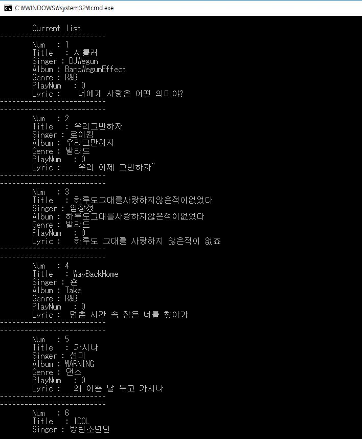
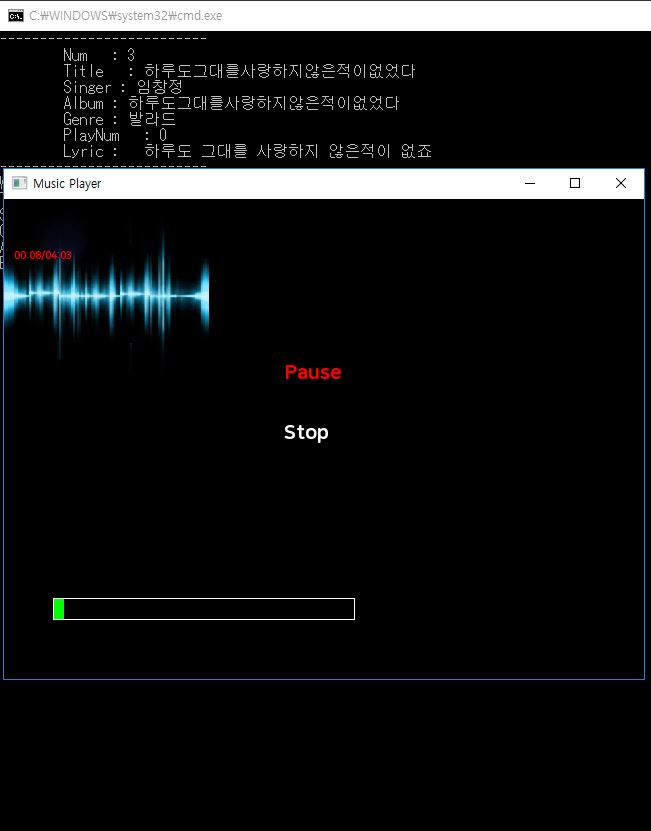

# Music-Player-s-Data-Structures-
Implemented by C++ in order to get intuition to see data structures.

# Folder Structure
	bin: 실행파일 (exe), 실행에 필요한 각종 파일들 (예: dll, lib 등)
	doc: 발표자료, 보고서, 실행화면 캡쳐 등
	src: 작업한 소스코드
  
# Development Environment

  Visual Studio 2015
  
# Program Screen Shots

뮤직 리스트

뮤직 
